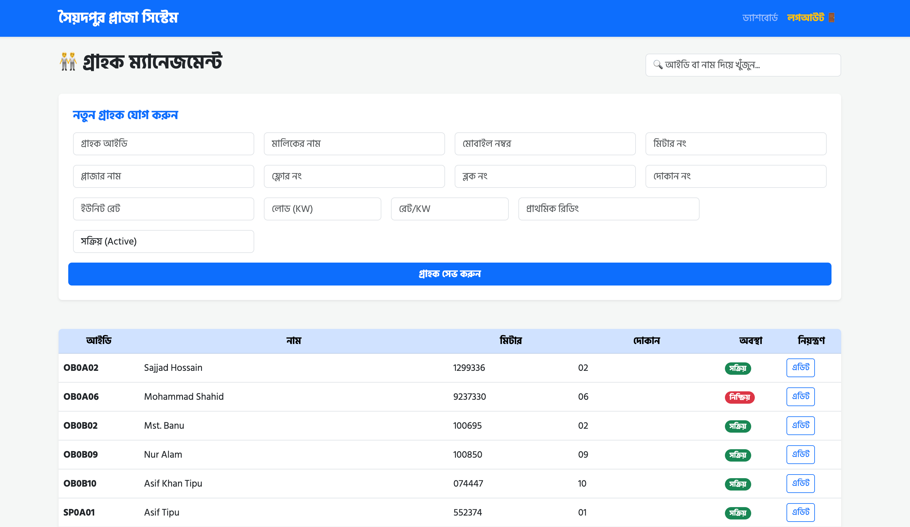
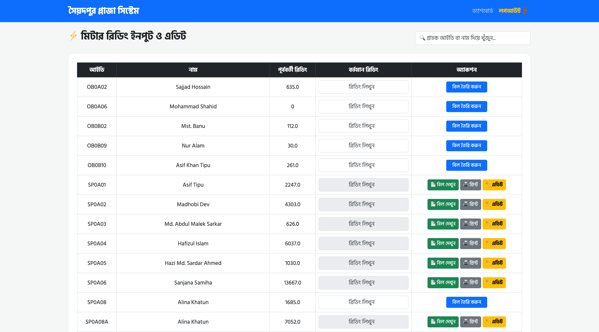
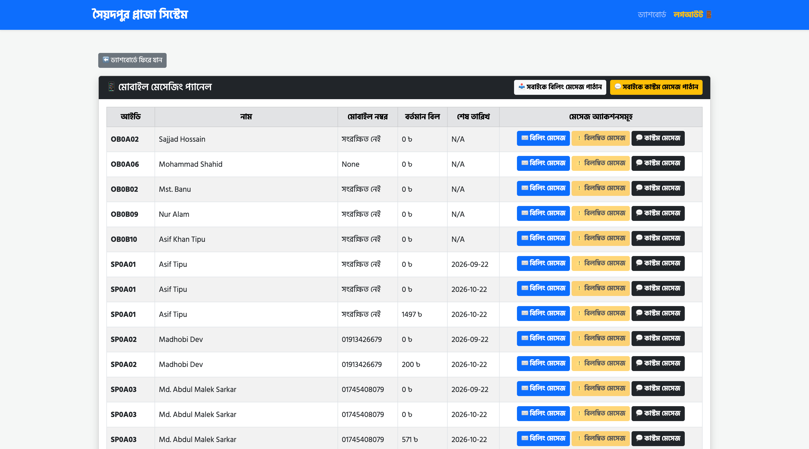
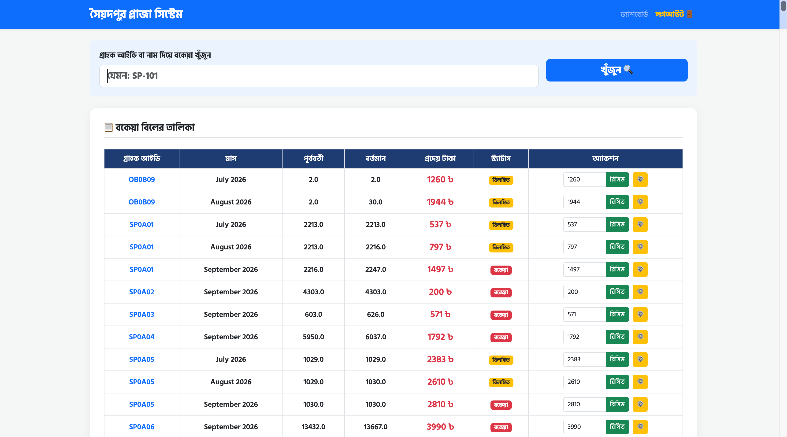
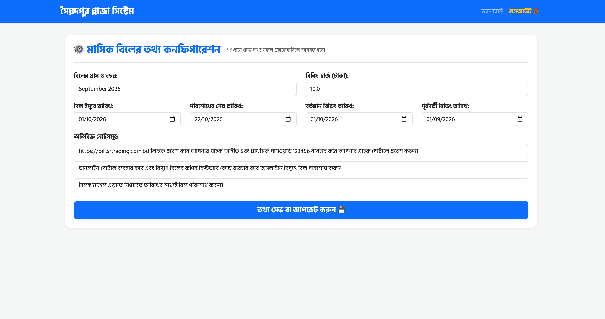

# Saidpur Plaza Electricity Billing System

সৈয়দপুর প্লাজা ইলেকট্রিসিটি বিলিং সিস্টেম — a full-stack **Flask + SQLite** application for end-to-end management of electricity billing inside Saidpur Plaza: customer/meter registry, monthly meter reading, automatic bill generation (energy charge, demand charge, VAT, arrears, late fee), counter collection, online payment verification, SMS notifications, and a self-service customer portal.

The whole UI is in **Bengali (বাংলা)**, built with Bootstrap, and it ships with a Docker setup so it can be deployed anywhere in one command.

---

## Table of Contents

- [Overview](#overview)
- [Screenshots & Features](#screenshots--features)
- [Billing Calculation](#billing-calculation)
- [Roles & Access Control](#roles--access-control)
- [Tech Stack](#tech-stack)
- [Getting Started](#getting-started)
- [Project Structure](#project-structure)

---

## Overview

| Module | What it does |
| --- | --- |
| Dashboard | Live stats (customers, billed amount, collected amount, arrears), pending online payment approval queue, quick links to every module |
| Customer Management | Add / search / edit customers with meter no, shop/floor/block, unit rate, allocated load, rate per KW, initial reading, mobile no & connection status |
| Meter Reading & Bill Generation | Enter current readings per customer, calculate units and charges, generate & lock monthly bills, view / print / edit them |
| Bill Collection Counter | Search a customer's arrears, receive payment (full or partial) at the counter, track payment history |
| Monthly Bill Configuration | Set the billing month, issue date, due date, reading dates, miscellaneous charge and the notes printed on every bill |
| Mobile Messaging | Bulk billing SMS, overdue SMS and custom SMS to customers via the BulkSMSBD gateway (with per-message logs) |
| Customer Portal | Customers log in with their customer ID to see bill history, arrears/late fee, download bills and pay online |
| Online Payment | bKash / Nagad / Rocket / banking-app QR payment with TrxID submission and admin approval workflow |
| Reports & Export | Daily collection report, monthly CSV report download, per-bill PDF download (WeasyPrint) |

---

## Screenshots & Features

### 1. Admin Dashboard (`ড্যাশবোর্ড`)

Role-aware landing page showing total customers, current month's billed vs. collected amount, total arrears, a search box for any customer's bill/payment history, the **Pending Online Payments** approval queue, and quick-action cards for every module.


---

### 2. Customer Management (`গ্রাহক ম্যানেজমেন্ট`)

Register new customers/owners with complete connection details — customer ID, owner name, mobile number, meter number, plaza/floor/block/shop, unit rate, allocated load (KW), rate per KW, initial reading and active/inactive status — then search and edit them from the list.



---

### 3. Meter Reading & Bill Generation (`মিটার রিডিং ও বিল তৈরি`)

Enter the current reading for each meter; the system computes consumed units against the previous reading and generates the bill. Already-billed meters lock for moderators (admin override available) and expose **View Bill / Print / Edit** actions; new readings show a **Create Bill** button.



---

### 4. Billing System & SMS Notification Panel (`বিলিং সিস্টেম`)

The billing operations panel used to push messages straight from the billing run: per-customer **Billing message**, **Overdue message** and **Custom message** actions, plus one-click **Bulk Billing Message** and **Bulk Custom Message** buttons. Each row shows the customer's current bill and due date so messages always match the live billing data.



---

### 5. Bill Collection Counter (`বিল কালেকশন কাউন্টার`)

Counter-side collection screen: search a customer by ID or name, list every unpaid/arrears bill with previous & current readings and payable amount, then receive the payment (editable amount for partial payment) in one click.



---

### 6. Monthly Bill Configuration (`মাসিক বিল কনফিগারেশন`)

Once per month the admin sets the billing month, miscellaneous charge, bill issue date, payment due date, current & previous reading dates, and the three notes that are printed on every bill (portal link, QR payment instruction, counter payment reminder).



---

### 7. Customer Portal Dashboard (`গ্রাহক ড্যাশবোর্ড`)

Customers log in with their customer ID + password and get a personal dashboard: greeting with customer ID and connection status, quick links to **Bill History**, **Online Payment** and **Change Password**, plus a month-by-month bill table with paid/arrears badges and late-fee aware payable amounts.


---

### 8. Customer Online Payment (`গ্রাহক অনলাইন পেমেন্ট`)

Digital payment counter supporting bKash / Nagad / Rocket / any banking app. It shows the payable amount (with late fee applied after the due date), the merchant QR code, and a **Submit TrxID** form. The TrxID is checked for duplicates, saved as a *Pending* payment, and only marked *Paid* after the admin approves it from the dashboard — an automatic confirmation SMS is then sent to the customer.


---

## Billing Calculation

For every meter, each month's bill is calculated as:

```
units_consumed  = current_reading - previous_reading
energy_charge   = units_consumed × unit_rate
demand_charge   = allocated_load × rate_per_kw
principal       = energy_charge + demand_charge + misc_charge
vat             = principal × 5%
arrears         = previous unpaid balance (carried forward)
total_payable   = ceil(principal + vat + arrears)
late_fee        = ceil(principal × 5%)          # applied after the due date
total_after_due = total_payable + late_fee
```

Bills can be printed on screen or downloaded as a **PDF** (WeasyPrint), and admin-only routes allow editing, instalment (কিস্তি) and waiver (মওকুফ) adjustments, all recorded in the `audit_log` table.

---

## Roles & Access Control

| Feature | admin | moderator | viewer |
| --- | :---: | :---: | :---: |
| Dashboard, reports, CSV export, bill view/print/PDF | ✅ | ✅ | ✅ |
| Meter reading & bill generation, bill collection | ✅ | ✅ | ❌ |
| Mobile messaging (bulk billing / custom SMS) | ✅ | ✅ (custom bulk restricted) | ❌ |
| Customer management, connection status | ✅ | ❌ | ❌ |
| Monthly bill configuration, bill edit/waiver | ✅ | ❌ | ❌ |
| Online payment approve / reject | ✅ | ❌ | ❌ |
| User accounts & admin settings | ✅ | ❌ | ❌ |

Staff log in at `/login`, customers log in at `/customer/customer_login`.

